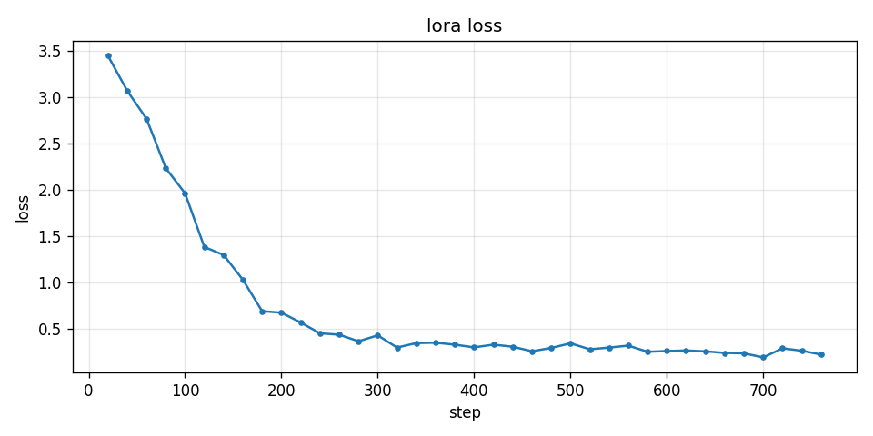
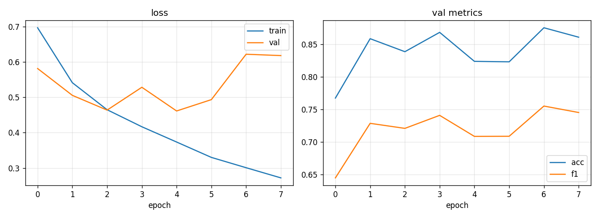
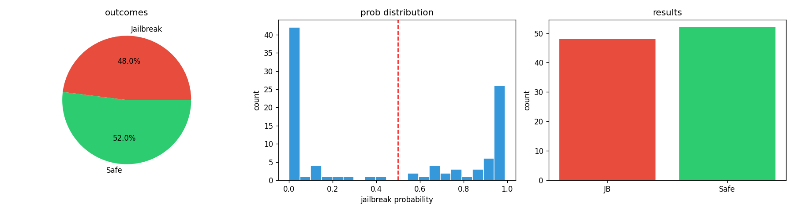

# RedTeam Hydra

**Adversarial prompt generation, target probing, and response safety classification pipeline.**

This project is a three-stage safety-research system:

1. **Fine-tune a jailbreak prompt generator** with LoRA on `JailbreakV-28K`.
2. **Run the generated attacks** against a target model.
3. **Train a custom Transformer classifier** to label model outputs as harmful or safe.

The result is an end-to-end red-team workflow with charts, CSVs, and saved checkpoints ready for analysis.

---

## Why this project stands out

This is not a toy notebook stack. It is a full pipeline with:

- **LoRA-based fine-tuning** for efficient jailbreak prompt generation
- **Custom BPE tokenizer + Transformer classifier** trained from scratch
- **Automated red-team evaluation** on generated adversarial prompts
- **Confidence analysis** through probability histograms and outcome summaries
- **Private weight handling** through Google Drive instead of GitHub for large or sensitive artifacts

---

## What the pipeline does

### 1) Jailbreak generator
Fine-tunes `Qwen/Qwen3-4B-Instruct-2507` on `JailbreakV-28K` to rewrite red-team queries into jailbreak-style prompts.

### 2) Inference and attack run
Uses the generator to create prompts, sends them to the target model `Qwen/Qwen3-1.7B`, then scores the responses.

### 3) Safety classifier
Trains a compact Transformer on `WildGuardMix` to classify responses as `harmful` or `unharmful`.

---

## Results snapshot

### Generator training
The LoRA loss drops sharply and then stabilizes, which is exactly what you want from a clean fine-tuning run.



### Classifier training
The classifier learns quickly. Validation metrics improve early, then start to wobble later, which signals mild overfitting near the end of training.



### Red-team evaluation
On **100 generated attack samples**, the classifier marked:

- **48 jailbreak**
- **52 safe**

The probability distribution is strongly bimodal, which means the classifier is not drifting in the middle. It is making hard calls.



---

## Tech stack

- `torch`
- `transformers`
- `peft`
- `datasets`
- `tokenizers`
- `accelerate`
- `bitsandbytes`
- `scikit-learn`
- `matplotlib`
- `pandas`
- `tqdm`

---

## Suggested repo layout

Use this structure if you want the GitHub repo to look sharp and readable.

```text
.
├── assets/
│   ├── classifier_training.png
│   ├── generator_loss.png
│   └── redteam_results.png
├── notebooks/
│   ├── 01_generator_finetune.ipynb
│   ├── 02_redteam_inference.ipynb
│   └── 03_safety_classifier.ipynb
├── data/
│   └── redteam_results.csv
├── models/
│   └── README.md
├── README.md
└── .gitignore
```

### Notes on the model files
The trained weights are intentionally **not committed to GitHub**.

Store the large model bundles in a private Google Drive folder and download them locally when needed.

Expected private artifacts:

```text
trained_models.zip
classifier_bundle.zip
```

Put the private Drive link in the section below.

---

## Private model download

**Google Drive weights:** `<ADD_PRIVATE_GOOGLE_DRIVE_LINK_HERE>`

---

## Reproduce the pipeline

### 1. Train the safety classifier
Run `03_safety_classifier.ipynb`.

### 2. Fine-tune the jailbreak generator
Run `01_generator_finetune.ipynb`.

### 3. Download the private weights
Extract:

- `trained_models.zip`
- `classifier_bundle.zip`

into the project root.

### 4. Run the red-team inference notebook
Run `02_redteam_inference.ipynb`.

### 5. Inspect the outputs
Review:

- `redteam_results.csv`
- `assets/generator_loss.png`
- `assets/classifier_training.png`
- `assets/redteam_results.png`

---

## Output artifacts

The notebooks generate:

- `trained_models.zip`  
  LoRA adapter bundle for the jailbreak generator

- `classifier_bundle.zip`  
  Transformer classifier checkpoint and tokenizer bundle

- `redteam_results.csv`  
  Per-sample seed prompt, generated jailbreak prompt, target response, label, and probability

- `redteam_results.png`  
  Outcome summary for the red-team run

- `generator_loss.png`  
  Fine-tuning loss curve for the jailbreak generator

- `classifier_training.png`  
  Training and validation curves for the safety classifier

---

## Implementation details

### Jailbreak generator
- Base model: `Qwen/Qwen3-4B-Instruct-2507`
- Dataset: `JailbreakV-28K/JailBreakV-28k`
- Samples used: `28,000`
- LoRA: `r=16`, `alpha=32`, `dropout=0.05`
- Learning rate: `1e-4`
- Epochs: `3`
- Batch size: `1`
- Gradient accumulation: `8`
- Max input length: `512`

### Safety classifier
- Dataset: `allenai/wildguardmix`
- Tokenizer: custom BPE
- Vocabulary size: `12,000`
- Max sequence length: `320`
- Transformer: `d_model=512`, `num_heads=8`, `num_layers=4`, `d_ff=2048`
- Dropout: `0.1`
- Epochs: `8`
- Batch size: `64`
- Learning rate: `2e-4`

---

## Project notes

- The generator notebook uses a hard time budget so training exits cleanly instead of cooking the GPU forever.
- The classifier notebook uses validation tracking and early stopping.
- The inference notebook checks the adapter checkpoint for NaNs before use.
- The pipeline is designed for transparency, reproducibility, and safety research.

---

## License

Add your preferred license here.
